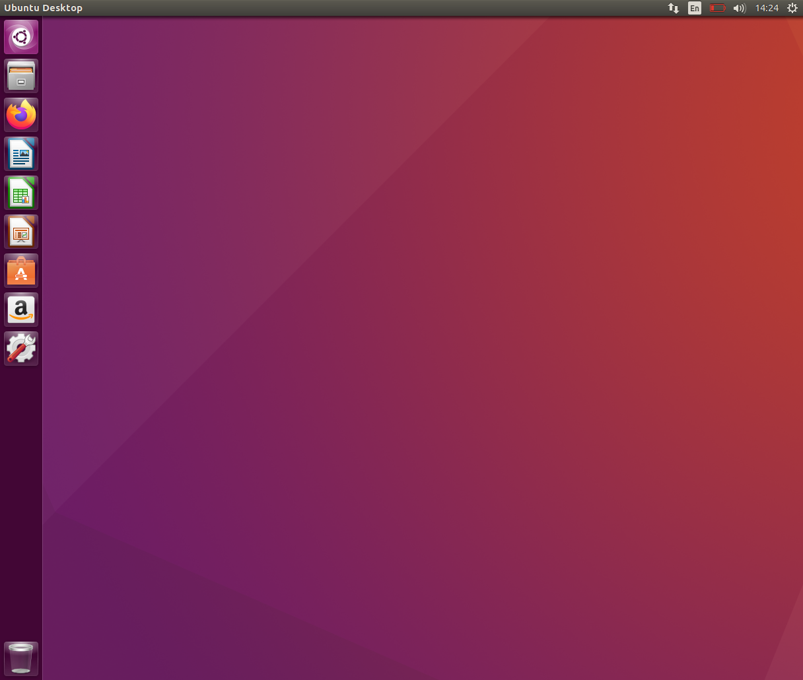
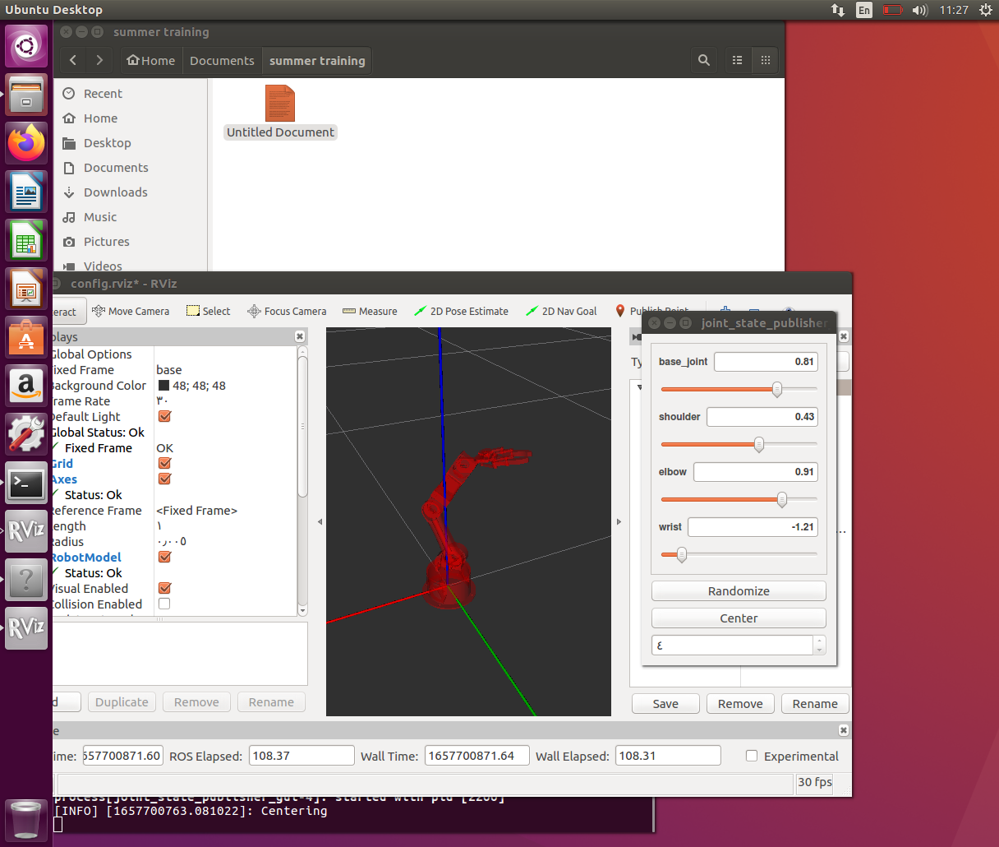

# Installing-Ros-On-Ubuntu

### First task in Artificial intelligence 🦾:
**step 1:** Install VirtualBox  
**step 2:** Download Ubuntu version 16.04 LTS  
**step 3:** Create a new Virtual Machine for Ros OS  
**step 4:** Click on start button then select the Ubuntu drive & wait for loading to end  
**step 5:** Copy the required commands from Smart Methos web & paste the commands in the Ubuntu Terminal  

Desktop View for Ubuntu 🖥 :  

  

Desktop View for Robotic Arm 🦾:  

### Resources 🔗:
○ https://www.virtualbox.org/wiki/Downloads  
○ https://releases.ubuntu.com/16.04/  
○ https://s-m.com.sa/ros.txt  
